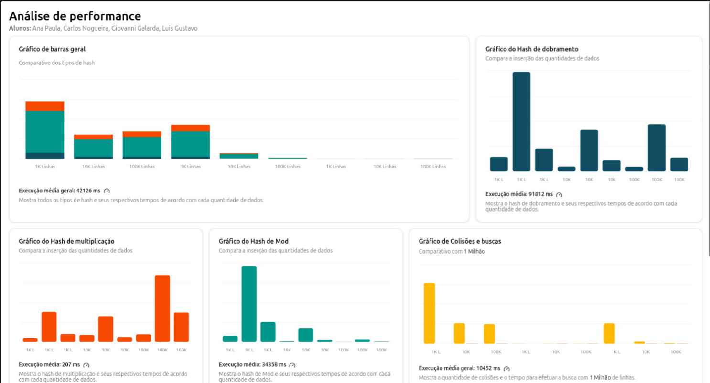
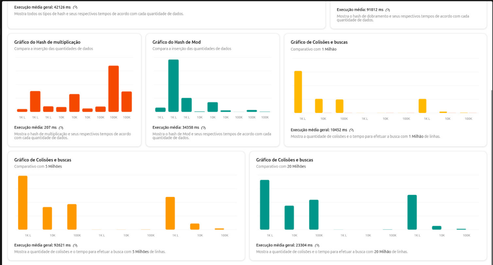

# Tabela Hash
Trabalho da disciplina de Resolução de Problemas Estruturados em Computação, esse trabalho tem o objetivo de implementar 3 tipos de tabela Hash, efetuar comparações de inserção e busca para cada tabela. O trabalho possui as seguintes caracteristicas:

* Implementação dos tipos de tabelas Hash: Hash por módulo, Hash por multiplicação e Hah por dobramento.

* Utilização de 3 tipos de tamanho para os vetore: 1000, 10000 e 100000.

* Inserção de 3 conjuntos de dados: 1 milhão, 5 milhões e 20 milhões.

# Classes:

* NoDobramento : responsável pelo No do Hash de dobramento
* TabelaHashDobramento : responsável por gerar a Tabela Hash por dobramento. 
* TabelaHashMod : responsável por gerar a Tabela Hash por módulo 
* TabelaHashMultiplicacao : responsável por gerar a Tabela Hash por dobramento.
* ITabelaHash : Interface responsável por padronizar os metódos utilizados nas classes responsáveis por gerar as tabelas.
* LeitorArquivo : efetua a leitura dos arquivos com os dados para inserção.
* No : classe do No utilizado nas classes de dos Hash por Multiplicaçã, e Hash por módulo.
* Registro : classe que para armazenar os dados do registro.
* Relatorio : responsável por gerar o relatório com os dados das comparações efetuadas pelo programa. 
* Main : classe principal que inicia o programa.

# Funcionalidades

* Inserção nas tabelas Hash.
* Remoção de elementos das tabelas.
* Busca elementos especificos nas tabelas Hash.
* Conta a quantidade de colisões no momento em que esta sendo inserido os dados nas tabelas.
* Conta a quantidade de comparações feitas para achar um elemento na tabela.
* Leitura de arquivos com dados para inserção nas tabelas.
* Criação de relatórios com os dados para comparação das ações de * Inserção e Busca
* Medição de tempo de execução do programa para efetuar a inserção e a busca.

# Gráfico
* Graficos com as comparações de Inserção para cada metódo de implementação das tabelas Hash:

* Graficos com as comparações de Buscas para cada metódo de implementação das tabelas Hash:

[Link para visualisar os gráficos.](https://gustacamara.github.io/hash-data-structure/)

# Análises

Com base nas análises feitas, é possível concluir que o metódo de Multiplicação teve um desempenho melhor para efetuar as inserções, em seguida vem o de Módulo, e por fim o de dobramento possui o pior desempenho.

Em relação aos tempos, temos o tempo mais rápido foi de 41 ms com o metódo de multiplicação, e o pior tempo foi de 315822 ms para inserção usando o metódo de dobramento.

O hash de multiplição gerou menos colisões, o que afetou o seu desempenho. Por sua vez, o hash de módulo causou mais colisões e isso causou uma piora no seu desempenho. E por fim, o devido a operações intermediárias de dividir e somar blocos, o hash por dobramento necessita de um processamento extra o que o torna mais custoso e lento na inserção dos dados.

Em relação à busca nas tabelas, pode-se concluir que para buscas em tabelas grandes os hash por módulo e dobramento são mais eficazes, pois o número de comparações é baixo. No entanto, o hash por multiplicação apresentou tempos de busca consistentemente menores, mesmo com mais comparações, devido à sua boa distribuição de chaves e acessos eficientes à memória, o que o torna muito eficaz em termos de desempenho prático.

# IDE 

A IDE escolhida para fazer o projeto foi o IntelliJ IDEA.

